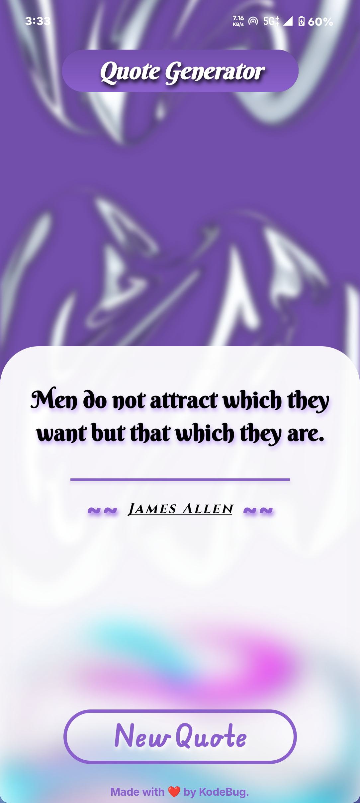
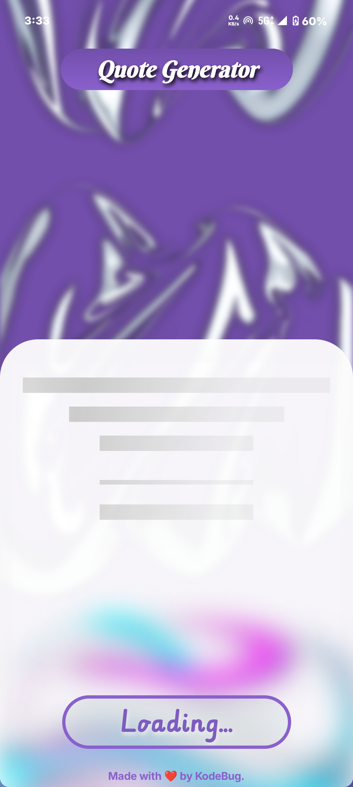

# 🧠 Random Quote Generator

A minimal and elegant Android app built using **Kotlin** and **Jetpack Compose** that displays a new random quote each time you open the app or tap the "New Quote" button.

> _"Words can inspire. And this app is built to deliver one spark at a time."_ ✨

---

## 📱 Features

- 🔁 Shows a **random quote** on app launch and on button click
- 🧑‍🏫 Displays both the **quote text** and the **author's name**
- 🧼 Clean and minimal UI focused on user readability
- ⚙️ Built using **modern Android architecture**

---

## 🛠️ Tech Stack

- **Kotlin**
- **Jetpack Compose** – for building the UI
- **MVVM Architecture** – to maintain separation of concerns
- **Hilt** – for Dependency Injection
- **Retrofit** – for networking and API calls

---

## 🔗 API Used

This app fetches quotes from:

**[ZenQuotes API](https://zenquotes.io/api/random)**  
> This API returns a random quote on each request.

⚠️ **Note:** The API key or complete endpoint is **not included in this repository** for security reasons.  
To run the project successfully, add the endpoint URL (`https://zenquotes.io/api/random`) manually in your API interface or `QuoteService` class.

---

<h3 align="center">🎨 Sleek & Cool-Looking UI</h3>
<p align="center">Built with Jetpack Compose for a clean, minimal, and modern quote experience.</p>


## 📸 Preview
|App launch logo           | Main Screen              | After Clicking "New Quote" Loading| 
|--------------------------|--------------------------|-----------------------------------|
|  |  |  |
---

<hr/>

<p align="center">
  Made with ❤️ by <b>KodeBug</b> — It's mine 😎
</p>

## 🚀 Getting Started

1. Clone this repository
2. Add the missing API endpoint in your data layer
3. Build & Run

```bash
git clone https://github.com/your-username/random-quote-generator.git
